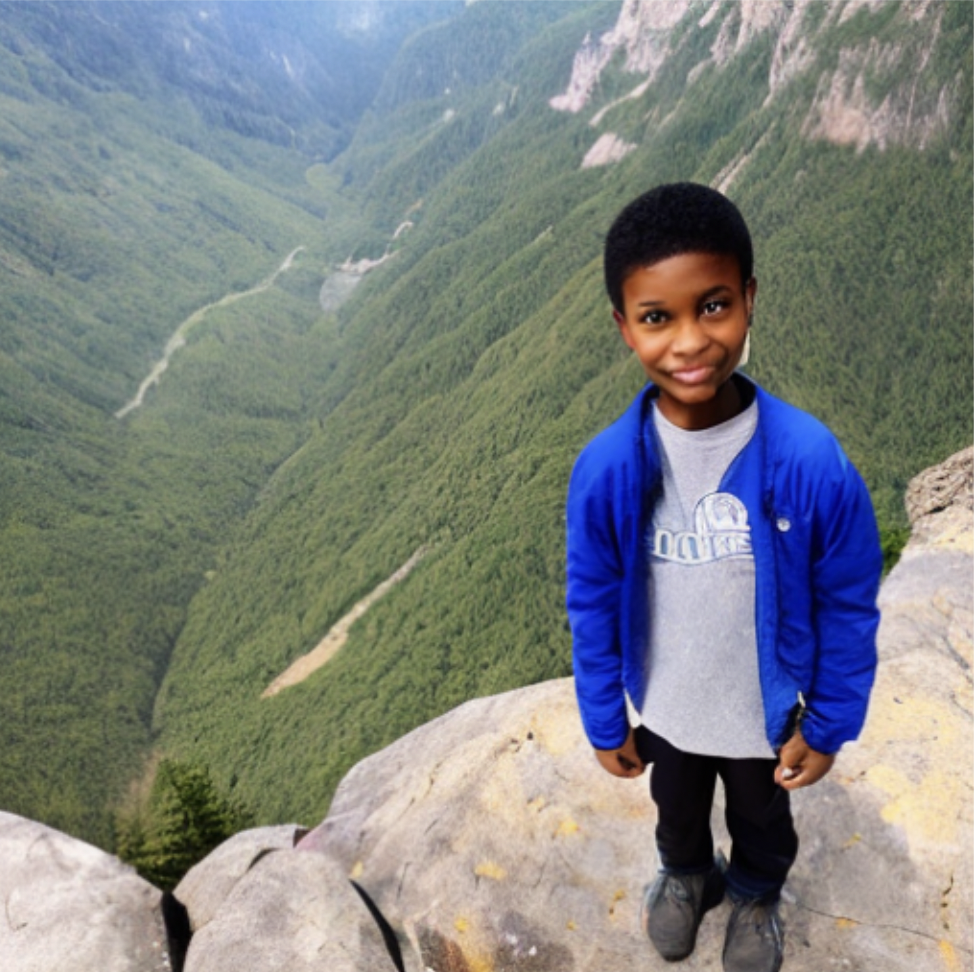

# Text-Based Object Discovery: An Extreme Classification Problem

This repository contains the experimentation and research work ongoing in this direction. Most part of the work is made available to be used in the form for Python packages below:
- [TITAN](https://github.com/RishiDarkDevil/TITAN): Synthetic Data Generation Pipeline.
- [DAAM-Image2Image](https://github.com/RishiDarkDevil/daam-i2i): Image2Image Self-Attention in Diffusion Models.

Object Detection have always been a fundamental chase in the Computer Vision community. Recent advancement with Deep Learning techniques, this problem has seen great solutions constantly improving the SOTA methods. Here, I explore and develope a new method for training these models efficiently. The underlying believe is Object Detection Deep Learning Methods, like all other supervised deep learning methods are data hungry. Object Detection in particularly hugely benefits for good quality detailedly labelled training data. The advent of Generative Models and recent release of Stable Diffusion Version 2 has brought in limelight the potential of these models to generate high quality image from text. So, I leverage this idea to label different parts of the generated image using the objects detected in the input prompt. The prompt contains objects and the image is also likely to contain that object, all that is needed to know is where is it present in the image. 

I use Global Attribution Attention Heatmaps to localize the object in the image using Diffussion Attentive Attention Maps to find these portions. Overlaying these objects with objects detected by extreme classification models like Detic posses huge potential to improve the Object Detection Models to detect more classes than ever detected.

**This work is currently under progress. Results will be updated as I go along finding interesting results. To show how my method shows some preliminary promising results. Below are few examples.**

# Diffusion-Based Object Detection

Prompt|Generated Image|Objects Detected
-|-|-
A boy stands on a rocky mountain.||
A boy stands on a rocky mountain.||
A brown and white dog exiting a yellow and blue ramp in a grassy area.||
